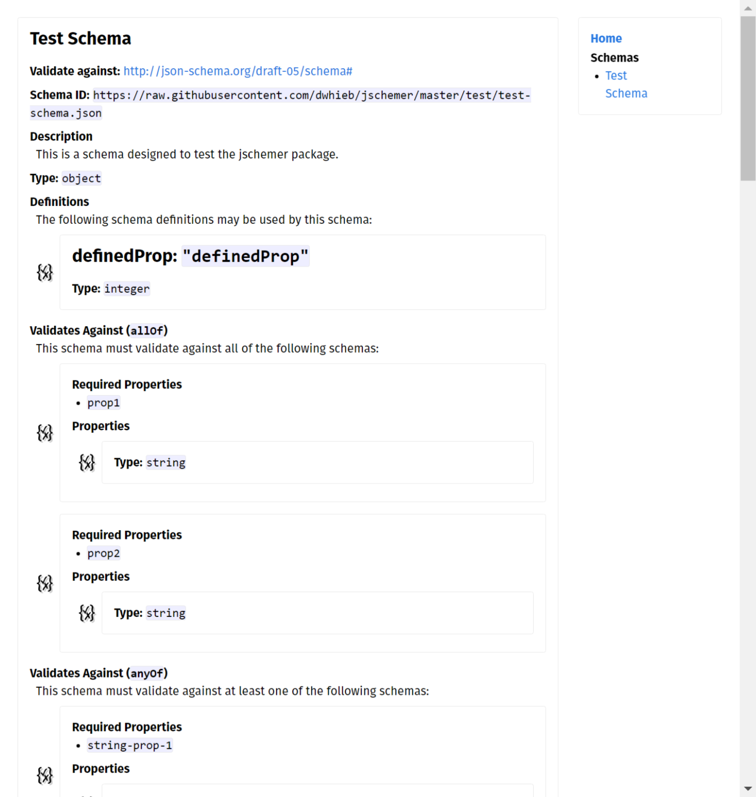

# jschemer

[](https://www.npmjs.com/package/jschemer)
[](https://www.npmjs.com/package/jschemer)
[](https://www.npmjs.com/package/jschemer)
[](https://travis-ci.org/dwhieb/jschemer)
[](https://github.com/dwhieb/jschemer/)
[](https://github.com/dwhieb/jschemer/issues)

A simple utility for generating clean HTML documentation pages from JSON Schema data using Node.

[View the live demo here]().



## Install
`npm install --save jschemer`

## Usage

### Command Line
```sh

# Compile a single file to the /out folder (default)
jschemer schema.json

# Compile the /schemas directory to the /docs folder
# NB: jschemer does not create documentation for items in subfolders/subdirectories
jschemer schemas --out docs
```

Option             | Description
------------------ | -----------
`-c`, `--css`      | The path to the CSS file to use for styling the documentation. Defaults to `out/jschemer.css`.
`-i`, `--ignore`   | A comma-separated (no spaces) list of filenames to ignore.
`-o`, `--out`      | The name of the directory to output files to. Defaults to `out`.
`-r`, `--readme`   | A `README.md` file to include in the generated documentation.

### Node
```js
const jschemer = require('jschemer');

const path = 'schemas'; // may be a directory or single file (NB: jschemer does not create documentation for items in subfolders/subdirectories)

const opts = {
  css:    'css/custom.css',
  ignore: ['ignored.json'],
  out:    '/docs',
  readme: 'README.md'
};

// the jschemer object is a function which returns a Promise when called
jschemer(path, opts).then(/* code to run when documentation has finished generating */)
```

## HTML
The HTML can be customized by changing the `index.hbs` file within the `/src` folder of the jschemer package.

## CSS
jschemer comes with a default CSS file, `jschemer.css`. You can easily customize this file, or use your own CSS file by passing a `css` option to jschemer. The HTML generated by jschemer is designed to be easy to style: each type of object and property is given an easily-identifiable class, such as `additional-items` or `description`. jschemer's default CSS is structured as follows:

* Each JSON Schema keyword/attribute is associated with exactly one CSS class in the generated documentation (e.g. `class=max-length`).

* camelCase keywords in JSON Schema are given a hyphen-separated CSS class name, e.g. `max-items`.

* HTML elements in the generated documentation are also given CSS classes labeling the data type they apply to: `array`, `numeric`, `object`, `string`. Attributes that apply to any data type, such as `type`, are given the class `any`. The metadata keywords such `title`, `description`, `default`, `id`, and `$schema` are given the class `meta` (as well as `any`). All properties are also given the `prop` class.

An example of the outputted HTML, with CSS classes:
```html
<div class='additional-items array prop'>
  <h2>Additional Items</h2>
  <code>true</code>
</div>
```

## Notes:

* If you would prefer the properties of a schema to display in a different order, I recommend using CSS3 Flexbox's `order` property to change their order. Note that this must then be set on all the sibling elements as well.

* jschemer assumes your JSON data is valid according to v4 of the JSON Schema specification. You should validate your JSON Schema data before running jschemer.
